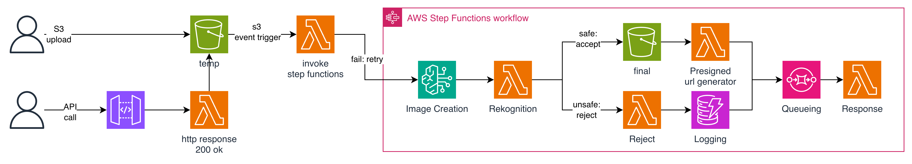

# 2주차 AI 툰 변환 서비스 아키텍처 설계 



## 개요

본 문서는 사용자가 업로드한 사진을 AI 모델이 만화 캐릭터 스타일로 변환하여 반환하는 서비스의 아키텍처를 설명한다. 이미지 변환은 약 1.5초에서 2.5초가 소요되는 CPU 집약적 작업이며, 인플루언서의 홍보 시점에 트래픽이 폭발적으로 증가하는 Burst 패턴을 가진다. 사용자는 요청 후 최대 5초 이내에 결과를 수신해야 한다는 UX 제약이 존재한다.

---

## 진입점 (Entry Point)

서비스는 두 가지 경로로 요청을 수신한다.

### 경로 1 — S3 직접 업로드

사용자가 S3 버킷에 이미지를 직접 업로드한다. S3 Event Trigger가 업로드를 감지하여 Lambda를 호출하고, 해당 Lambda가 AWS Step Functions 워크플로우를 시작한다. 이 경로는 모바일 클라이언트나 대용량 파일 전송에 적합하다.

### 경로 2 — API Gateway 호출

사용자가 API Gateway를 통해 REST 요청을 전송한다. Lambda는 요청을 수신하는 즉시 HTTP 200 OK를 반환하여 클라이언트와의 연결을 해제하고, 내부적으로 이미지를 S3 임시 버킷에 저장한다. 이후 S3 Event Trigger를 통해 경로 1과 동일한 흐름으로 합류한다. 클라이언트에 즉각적인 응답을 돌려주는 비동기 패턴으로, 웹 클라이언트에 자연스러운 REST 흐름을 제공한다.

두 경로는 모두 S3 임시 버킷을 거쳐 Step Functions 워크플로우로 수렴한다.

---

## AWS Step Functions 워크플로우

Step Functions는 이미지 변환 및 유해성 검토의 전체 생명주기를 오케스트레이션한다. Burst 트래픽 상황에서도 Bedrock 호출에 대한 재시도(Retry), 타임아웃, 에러 분기를 선언적으로 관리할 수 있다.

### 1단계 — 이미지 생성 (Image Creation)

Amazon Bedrock을 호출하여 사용자의 원본 이미지를 만화 스타일로 변환한다. Bedrock의 `InvokeModel` API는 동기 방식으로 응답하므로, 결과를 얻기 위한 별도의 폴링 과정은 필요하지 않다. Bedrock 호출이 실패할 경우, Step Functions의 `Retry` 정책에 따라 지정된 횟수만큼 재시도한다.

### 2단계 — 유해성 검토 (Rekognition)

Bedrock이 생성한 이미지를 Amazon Rekognition의 `DetectModerationLabels` API로 검사한다. 이 작업은 Lambda를 통해 호출되며, Bedrock이나 별도의 AI 모델 없이 AWS SDK만으로 동작하는 독립적인 완성형 서비스다. 신뢰도(Confidence) 임계값은 80%로 설정하며, 노출, 폭력, 혐오 상징 등 유해 카테고리 탐지 결과를 기준으로 이후 분기를 결정한다.

---

## 분기 처리

### Safe 경로 — 정상 결과 반환

유해 콘텐츠가 감지되지 않은 경우 다음 순서로 처리된다.

1. 생성된 이미지를 임시 버킷에서 최종 버킷(final bucket)으로 이관하여 저장한다.
2. Presigned URL을 생성하여 사용자가 결과 이미지에 직접 접근할 수 있도록 한다.
3. Queueing 단계를 통해 응답을 전달하고, Response Lambda가 WebSocket 또는 SNS를 통해 사용자에게 결과 URL을 전송한다.

임시 버킷과 최종 버킷을 분리함으로써, 유해 이미지가 사용자에게 노출되는 버킷에 도달하는 것을 구조적으로 차단한다.

### Unsafe 경로 — 거부 처리

유해 콘텐츠가 감지된 경우 다음 순서로 처리된다.

1. Reject Lambda가 해당 이미지를 폐기하고 거부 이벤트를 생성한다.
2. Logging 단계에서 탐지된 유해 레이블과 메타데이터를 DynamoDB에 기록한다.
3. Queueing과 Response Lambda를 거쳐 사용자에게 변환 실패 알림을 전송한다.

Safe 경로와 Unsafe 경로는 Queueing → Response Lambda 구간에서 합류하여 단일 응답 파이프라인으로 처리된다.

---

## 버킷 구성

| 버킷 | 역할 |
|---|---|
| temp bucket | 원본 업로드 수신 및 Bedrock 생성 직후 임시 저장. Rekognition 검사 대상 |
| final bucket | Safe 판정 이후에만 이미지가 저장되는 결과 버킷. 사용자에게 Presigned URL로 노출 |

---

## 클라이언트 결과 수신

Response Lambda는 WebSocket API Gateway 또는 SNS Push를 통해 사용자에게 최종 결과를 전달한다. 5초 UX 마지노선을 충족하기 위해서는 클라이언트 폴링보다 WebSocket을 통한 서버 푸시 방식이 권장된다. 정상 결과의 경우 Presigned URL이, 거부 결과의 경우 실패 사유 메시지가 전달된다.

---

## 전체 플로우 요약

```
사용자
  |
  |-- S3 직접 업로드 -------> temp bucket
  |                                |
  |-- API GW -> Lambda(200 OK) -> temp bucket
                                   |
                             S3 Event Trigger
                                   |
                          Lambda (SF 실행 시작)
                                   |
                    +--- Step Functions 워크플로우 ---+
                    |                                 |
                    |  [1] Image Creation (Bedrock)   |
                    |         fail: retry             |
                    |  [2] Rekognition 유해성 검토    |
                    |         |              |        |
                    |       SAFE           UNSAFE     |
                    |         |              |        |
                    |    final bucket    Reject Lambda |
                    |    Presigned URL   Logging(DDB) |
                    |         |              |        |
                    |       Queueing <-- Queueing     |
                    |         |                       |
                    |    Response Lambda              |
                    +--------------------------------- +
                                   |
                    WebSocket / SNS --> 사용자
                    (결과 URL 또는 거부 메시지)
```

