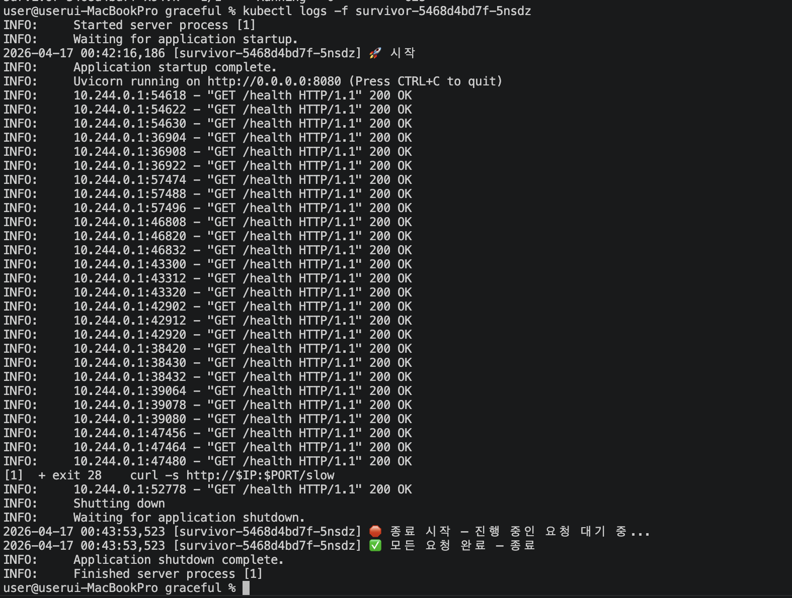

# Kubernetes Graceful Shutdown 및 데이터 정합성 실험 정리

## 배경

Kubernetes의 Self-healing은 "Pod가 죽으면 알아서 살려준다"는 것까지는 알고 있었다.

이를 조금 더 실제 상황과 연관시키기 위해, Pod가 죽는 그 순간, 처리 중이던 요청과 데이터는 안전한지에 초점을 맞춰 실험을 진행하고자 했다.

실험은 DB가 연결된 주문 API를 직접 만들고, 세 가지 버전으로 실험했다.

---

## 실험 구조

**시나리오**: 주문 생성 API — 2단계로 구성

```
POST /order/widget
  1단계: orders 테이블에 주문 INSERT
  ---- 3초 대기 (실제 처리 시뮬레이션) ----
  2단계: inventory 테이블에서 재고 차감
```

2단계 직전에 Pod를 강제 종료하면 어떤 일이 벌어지는가?

**검증 지표**: `/stock` 엔드포인트의 `consistent` 필드
```json
{
  "stock": 99,
  "order_count": 1,
  "consistent": true   // stock == 100 - order_count 이면 정합성 유지
}
```

<p align="center"></p>

---

## v1 — 트랜잭션 없음

### 코드

```python
async def order_v1(item):
    async with pool.acquire() as conn:
        order_id = await conn.fetchval(
            "INSERT INTO orders (item) VALUES ($1) RETURNING id", item
        )
        await asyncio.sleep(3)  # 여기서 Pod 죽이면?
        await conn.execute(
            "UPDATE inventory SET stock = stock - 1 WHERE item = $1", item
        )
```

### 결과

```json
{
  "stock": 100,       // 재고 그대로
  "order_count": 1,  // 주문은 생김
  "consistent": false // 데이터 깨진 상태 확인
}
```

### 무슨 일이 일어났나

1단계(INSERT)는 완료됐고 DB에 커밋됐다.
Pod가 죽으면서 2단계(UPDATE)는 실행조차 안 됐다.
주문은 생겼는데 재고는 안 줄었다.
-> 실제 서비스였다면 재고 없는 상품이 팔린 것이 된다.

---

## v2 — 트랜잭션 있음

### 코드

```python
async def order_v2(item):
    async with pool.acquire() as conn:
        async with conn.transaction():  # 트랜잭션 시작
            order_id = await conn.fetchval(
                "INSERT INTO orders (item) VALUES ($1) RETURNING id", item
            )
            await asyncio.sleep(3)  # 여기서 Pod 죽이면?
            await conn.execute(
                "UPDATE inventory SET stock = stock - 1 WHERE item = $1", item
            )
```

### 결과

```json
{
  "stock": 100,
  "order_count": 0,
  "consistent": true  // 롤백
}
```

PostgreSQL 로그:
```
FATAL: unexpected EOF on client connection with an open transaction
```

### 무슨 일이 일어났나

트랜잭션 덕분에 데이터는 살았다. Pod가 죽으면서 커넥션이 강제로 끊겼고, PostgreSQL이 열린 트랜잭션을 자동으로 롤백했다.

근데 문제가 두 가지 있다.

첫째, 클라이언트 입장에서는 주문이 실패한 건지 성공한 건지 알 수 없다.
응답 자체가 없으니까.

둘째, DB 입장에서는 비정상 종료다.
`unexpected EOF` 에러가 로그에 쌓이고, 커넥션이 zombie 상태로 잠깐 남는다.
Pod를 막 죽이는 환경에서는 이게 누적되면 커넥션 풀이 고갈되는 상황으로 이어진다.
새로 뜬 Pod들이 커넥션을 못 얻어서 전체가 먹통되는 장애가 생긴다.

---

## v3 — 트랜잭션 + Graceful Shutdown

### 추가된 설계 요소 두 가지

**앱 코드 레벨**: lifespan에서 진행 중인 요청 대기

```python
@asynccontextmanager
async def lifespan(app):
    pool = await asyncpg.create_pool(DB_URL)
    yield
    # SIGTERM 받은 뒤 여기로 옴
    while active_requests > 0:
        await asyncio.sleep(0.5)  # 요청 다 끝날 때까지 대기
    await pool.close()            # 커넥션 정상 종료
```

**인프라 레벨**: deployment.yaml

```yaml
terminationGracePeriodSeconds: 30  # SIGKILL 전 대기 시간
lifecycle:
  preStop:
    exec:
      command: ["sleep", "5"]      # Service에서 Pod 제거될 때까지 대기
```

### 결과

Pod 삭제 후 로그:
```
 종료 시작 — 진행 중인 요청(1개) 대기...
 아직 1개 처리 중...
재고 차감 완료
 DB 커넥션 종료 완료
```

```json
{
  "stock": 99,
  "order_count": 1,
  "consistent": true  // 트랜잭션 완료 후 종료 
}
```

### 상세 설명

k8s가 Pod를 삭제할 때 일어나는 일의 순서:

```
kubectl delete pod
  │
  ├── 1. Service에서 Pod IP 제거 시작 (시간 걸림)
  ├── 2. preStop hook 실행 (sleep 5초)    ← 1번이 완료될 때까지 gap을 메움
  ├── 3. SIGTERM을 앱에 전송
  ├── 4. lifespan의 yield 이후 코드 실행  ← 요청 완료 대기
  ├── 5. DB 커넥션 풀 정상 종료
  └── 6. 프로세스 종료
```

preStop이 없으면 1번과 3번이 race condition을 만든다.
Service가 아직 트래픽을 이 Pod로 보내는데, Pod는 이미 SIGTERM 받고 종료 중인 상황.
그 사이에 들어온 요청은 그냥 버려진다.

---

## 세 버전 비교

| | v1 | v2 | v3 |
|---|---|---|---|
| 데이터 정합성 | 깨짐  | 유지 (롤백) | 유지 (완료) |
| 트랜잭션 | 없음 | 있음 | 있음 |
| Graceful Shutdown | 없음 | 없음 | 있음 |
| DB 커넥션 종료 | 강제 | 강제 | 정상 |
| 클라이언트 응답 | 없음 | 없음 | 정상 응답 |
| DB 에러 로그 | 있음 | 있음 | 없음 |

---

## 실무에서 이 값들을 어떻게 결정하는가

**`terminationGracePeriodSeconds`**
가장 오래 걸리는 트랜잭션 시간 × 2 + preStop 시간.
너무 크게 잡으면 배포가 느려지고, 너무 작게 잡으면 강제 종료(SIGKILL)가 트랜잭션을 끊는다.

**`preStop sleep`**
보통 5~10초. 클라우드 환경 LB의 타겟 제거 반영 시간을 감안한다.
이 값이 없으면 Service가 트래픽을 보내는 동안 Pod가 종료되는 짧은 구간이 생긴다.

**커넥션 풀 명시적 종료**
PostgreSQL은 max_connections 제한이 있다.
강제 종료로 zombie 커넥션이 쌓이면 새 Pod들이 커넥션을 못 얻는다.
반드시 lifespan 종료 구간에서 `await pool.close()` 를 호출해야 한다.

---

## 트러블슈팅 기록

실험 중 마주친 문제들과 해결 과정.

**문제 1**: `ErrImageNeverPull`
`eval $(minikube docker-env)` 없이 이미지를 빌드하면 minikube 내부가 아니라 로컬 Mac에만 이미지가 생긴다.
minikube는 자신의 Docker 데몬을 따로 갖고 있기 때문.

**문제 2**: asyncpg SSL 연결 실패 (`ConnectionRefusedError`)
asyncpg가 기본으로 SSL 연결을 시도하는데, 로컬 PostgreSQL에는 SSL 설정이 없다.
DB_URL에 `?sslmode=disable` 추가로 해결.

**문제 3**: Mac에서 NodePort 접근 불가
Mac + Docker 드라이버 환경에서는 `minikube ip`로 NodePort에 직접 접근이 안 된다.
`kubectl port-forward svc/survivor-svc 8080:8080` 으로 우회.

